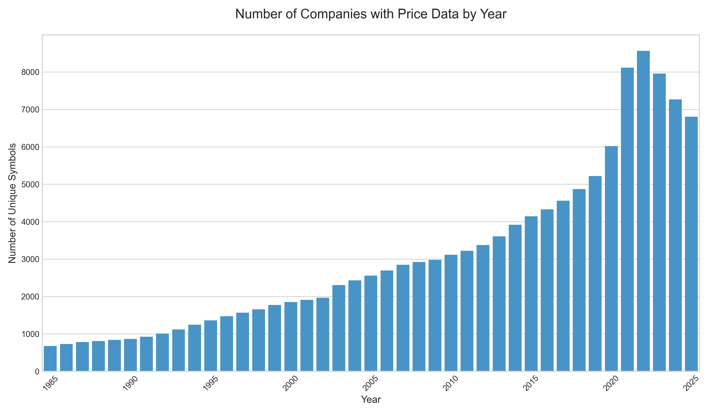

# Financial Modeling Prep Data Pipeline

## My Motivation

I started this project to build a point-in-time dataset for the purpose of backtesting long-term portfolio strategies, drawing inspiration from the work of Dimensional Fund Advisors and UChicago faculty.

Honestly, I went into this with no real experience in querying APIs. I spent a lot of time digging through the FMP docs, running manual queries to figure out what the data flow should look like, and then pseudocoded the whole thing. From there, I worked with Gemini to code each notebook. I validated the data at every step, so I'm confident the final dataset is as good as FMP's data is.

## How to Run the Pipeline

1.  **API Key**: You have to get your own FMP API key. Create a `.env` file in the root directory and stick this in it:
    `API_KEY='your_key_goes_here'`

2.  **Run Order**: Just run the notebooks in this order, as each one builds on the last.
    1.  `Ticker Symbols/Creating Symbol Lists.ipynb`
    2.  `Statements/Getting Statement Data.ipynb`
    3.  `Prices/Getting Price Data.ipynb`
    4.  `Market Caps/Getting Market Caps.ipynb`

## Key Findings & Data Considerations

My main goal was to create a dataset that minimized survivorship bias, but of course, it's all limited by the source data. While I managed to pull a massive amount of historical data, I did run into some important limitations with the FMP API.

### Incomplete Historical Universe & Delisting Bias
FMP definitey has issues with incomplete symbols, so I would **not** say that this dataset will solve for the de-listing bias. For example, the company Michaels (ticker: MIK), which was publicly traded until its acquisition in 2021, was absent from the delisted symbols list. I emailed FMP about this and they basically said "wow yeah that sucks lol". This suggests that M&A activity may not be fully captured.

On top of that, the number of unique companies per year in my dataset doesn't really line up with what we know about market history. McKinsey cites that there were like 6000+ publicly traded companies in 1996 and that the number has been falling since then, but my data shows the opposite. This makes me think FMP's de-listed companies endpoint is pretty bad.

### Symbol Inclusion Criteria
I made the call to remove any symbol with a "." in the name. My thinking was that these are usually ADRs or something similar, and I wanted to focus on common stock. I'm not 100% sure this was the right move, but when I checked the Russell 3000, only 5 out of 2,603 symbols had a ".", so I feel pretty safe about the decision's impact.

### A Note on Local Data Sourcing
You'll notice a step in the `Prices/Getting Price Data.ipynb` notebook that tries to process a large local CSV file. This was just a personal workaround for me, as I had a bunch of data from previous failed attempts. If you're running this from scratch, you don't need this file. You can just let that step fail; the next part of the notebook will call the API to get all the data it needs anyway.

### Robust and Resumable Fetching
The biggest technical hurdle was figuring out how to download decades of data for over 10,000 symbols without it failing halfway through. I built the fetching scripts to be:
-   **Asynchronous**: Using `aiohttp` and `asyncio` to handle dozens of concurrent API requests.
-   **Resumable**: Data for each symbol is saved to a `partials` directory. A stopped script can be restarted without losing progress.
-   **Rate-Limit Aware**: The scripts include delays and semaphore limits to stay within the FMP API's rate limits.